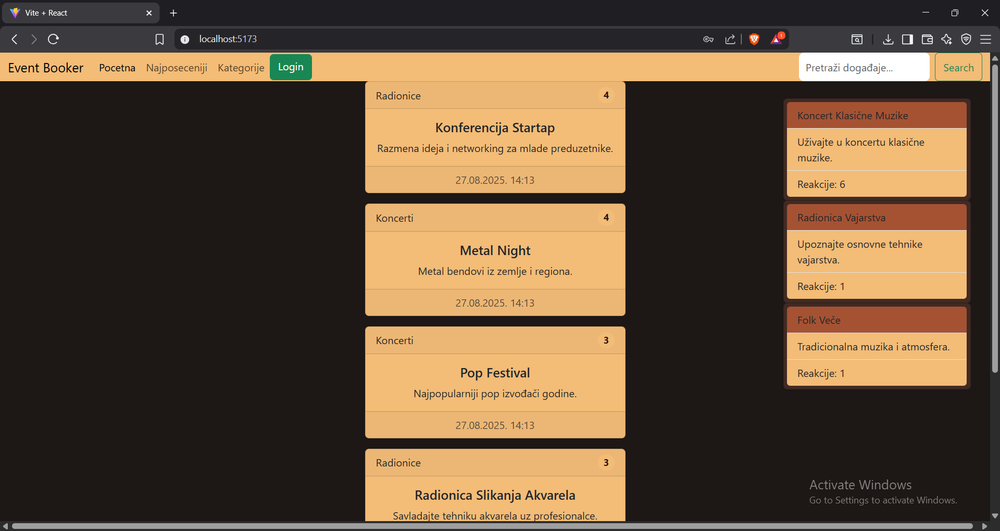
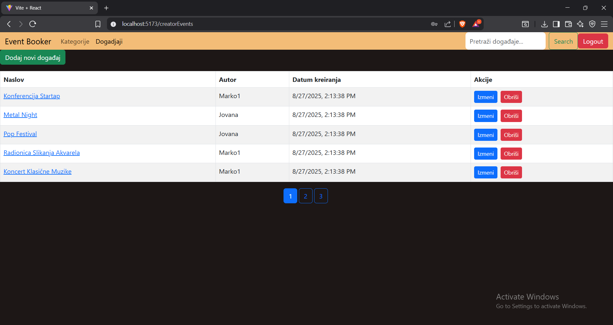
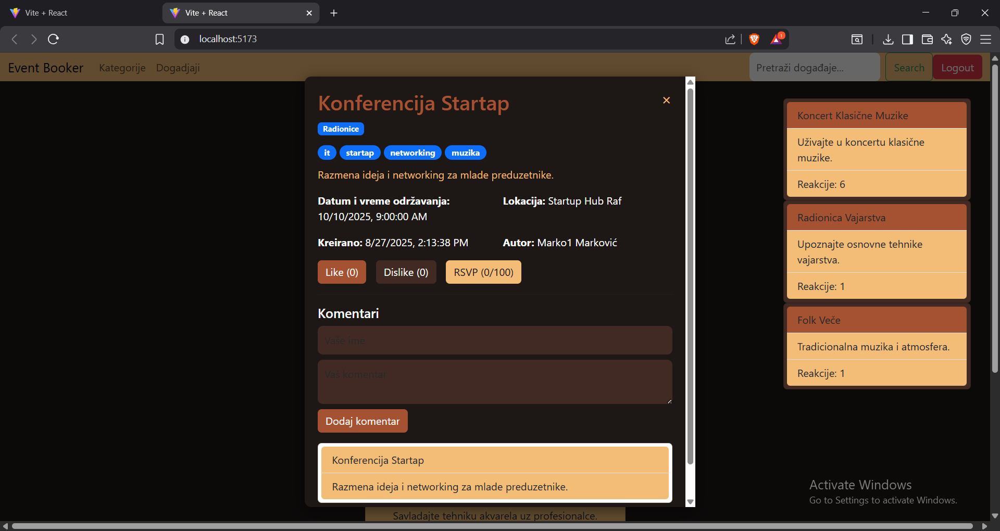
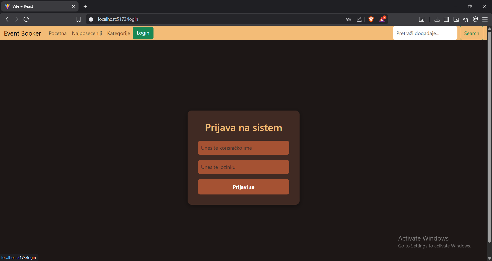

# 🎟️ RAF Event Booker

Web aplikacija za oglašavanje i pregled događaja — omogućava korisnicima da organizuju, pregledaju i komentarišu događaje u različitim kategorijama.  
Projekat je urađen kao završni zadatak iz predmeta **Veb programiranje** na Računarskom fakultetu.

---

## 📘 Opis projekta

**RAF Event Booker** je platforma koja se sastoji iz dva dela:

1. **EMS (Event Management System)** — deo za registrovane korisnike i administratore.
2. **Javna platforma** — deo dostupan svim posetiocima, gde se događaji mogu pretraživati, pregledati i komentarisati.

Aplikacija omogućava:
- Kreiranje, uređivanje i brisanje događaja.
- Upravljanje kategorijama i korisnicima (admin).
- Pretragu događaja po naslovu i opisu.
- Prikaz najposećenijih i najnovijih događaja.
- Sistem komentarisanja i reakcija (like/dislike).
- Prijavu na događaje (RSVP) sa ograničenim kapacitetom.
- Prikaz sličnih događaja na osnovu tagova.

---

## 🧠 Funkcionalnosti

### 👤 Korisnici
- **Event creator** – može da kreira i menja događaje, upravlja komentarima.
- **Admin** – ima sve privilegije event creatora + može da dodaje, menja i deaktivira korisnike.

### 📅 Događaji
- Naslov, opis, lokacija, datum održavanja i kategorija (obavezna polja)
- Tagovi i opcioni maksimalni kapacitet (RSVP)
- Broj pregleda (views) se automatski uvećava pri prvom otvaranju
- Like / dislike sistem po događaju i komentaru

### 💬 Komentari
- Svi posetioci mogu ostaviti komentar (ime i tekst obavezni)
- Like / dislike sistem po komentaru
- Komentari su sortirani opadajuće po datumu

### 🔍 Pretraga i filtriranje
- Pretraga događaja po naslovu ili opisu
- Filtriranje po kategorijama i tagovima
- Sekcija “Pročitaj još” prikazuje do 3 slična događaja
- Sekcija “Najviše reakcija” prikazuje 3 događaja sa najviše lajkova/dislajkova

### 🧾 Paginacija
- Sve tabele i liste su paginirane (10 rezultata po stranici)

---

## ⚙️ Tehnologije

### Frontend
- **React**
- CSS (može se koristiti Bootstrap ili TailwindCSS)
- Axios za komunikaciju sa backendom

### Backend
- **Java JAX-RS (REST API)**
- JSON za razmenu podataka
- Token ili sesijska autentifikacija
- Validacija i upravljanje greškama na backendu

### Baza podataka
- **MySQL / PostgreSQL** (relaciona baza)
- Svi entiteti (korisnici, događaji, komentari, kategorije, tagovi, RSVP) čuvaju se u bazi


---

## 🚀 Pokretanje aplikacije

### Backend

1. Uđi u `backend` direktorijum:
   ```bash
   cd backend
2. Pokreni projekat (npr. preko Maven-a ili IDE-a).
3. Backend API će biti dostupan na:
http://localhost:8081/api

### Frontend

1. Uđi u frontend direktorijum:
    cd frontend
2. Instaliraj dependensije:
   npm install
3. Pokreni razvojni server:
   npm run dev
4. Aplikacija će biti dostupna na:
http://localhost:5173

## 🔐 Nalozi i uloge

Na početku se u bazi ručno unosi admin korisnik, npr.:

INSERT INTO korisnik (ime, prezime, email, lozinka, tip, status)
VALUES ('Admin', 'User', 'admin@example.com', 'hashovana_lozinka', 'admin', 'aktivan');

## Glavne komponente

| Modul                                | Opis                                    |
| ------------------------------------ | --------------------------------------- |
| **Login / Logout**                   | Autentifikacija korisnika               |
| **Kategorije**                       | CRUD operacije nad kategorijama         |
| **Događaji**                         | Kreiranje, izmena, brisanje, pretraga   |
| **Komentari**                        | Dodavanje i pregled komentara           |
| **RSVP sistem**                      | Prijava korisnika na događaje           |
| **Like/Dislike**                     | Reakcije na događaje i komentare        |
| **Najposećeniji / Najviše reakcija** | Statistički prikazi na javnoj platformi |

## 📧 Autor

- Ime i prezime: Đorđe Teofilović
- Indeks: 90/23RN
- Predmet: Veb programiranje – Računarski fakultet
- Godina: 2025.

## 🧾 Licenca
- Ovaj projekat je urađen u edukativne svrhe i nije namenjen komercijalnoj upotrebi.

---


## 📸 Screenshots
- U nastavku su prikazani neki delovi aplikacije — korisnički interfejs, EMS panel i javna platforma.

| Opis slike                                                         | Slika                                                      |
| ------------------------------------------------------------------ |------------------------------------------------------------|
| 🏠 **Početna stranica** – prikaz najnovijih događaja               |         |
| 📅 **Pregled događaja** – lista sa paginacijom i pretragom         |       |
| 🧾 **Detalji događaja** – prikaz informacija, komentara i reakcija |  |
| 🔐 **Login stranica** – autentifikacija korisnika                  |       |

